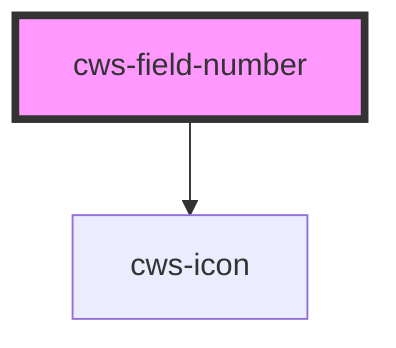

# cws-field-number

<!-- Auto Generated Below -->

## Properties

| Property         | Attribute         | Description                                                                   | Type                   | Default     |
| ---------------- | ----------------- | ----------------------------------------------------------------------------- | ---------------------- | ----------- |
| `disabled`       | `disabled`        | disabled input prop                                                           | `boolean`              | `false`     |
| `disabledButton` | `disabled-button` | If true, disabled only buttons when input value is equal to min and max props | `boolean`              | `false`     |
| `error`          | `error`           | Component error state                                                         | `boolean`              | `false`     |
| `height`         | `height`          | Input height                                                                  | `"lg" \| "md" \| "sm"` | `'md'`      |
| `hint`           | `hint`            | Input hint message                                                            | `string`               | `undefined` |
| `label`          | `label`           | Input hint message                                                            | `string`               | `undefined` |
| `max`            | `max`             | Set a max value input prop                                                    | `number`               | `undefined` |
| `min`            | `min`             | Set a min value to input                                                      | `number`               | `undefined` |
| `name`           | `name`            | Name component prop                                                           | `string`               | `undefined` |
| `value`          | `value`           | Value input prop                                                              | `number`               | `1`         |

## Dependencies

### Depends on

- [cws-icon](../cws-icon)

### Graph

----------------------------------------------

*Built with [StencilJS](https://stenciljs.com/)*
