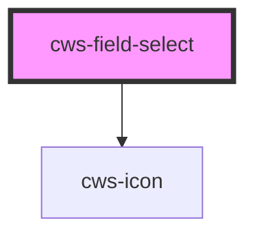

# cws-field-select

<!-- Auto Generated Below -->

## Properties

| Property           | Attribute            | Description                                | Type      | Default        |
| ------------------ | -------------------- | ------------------------------------------ | --------- | -------------- |
| `clearIfInvalid`   | `clear-if-invalid`   | Clear field value if no item match with it | `boolean` | `true`         |
| `disabled`         | `disabled`           | Select disabled prop                       | `boolean` | `false`        |
| `error`            | `error`              | Select error prop                          | `boolean` | `false`        |
| `hint`             | `hint`               | Select helper message                      | `string`  | `undefined`    |
| `inline`           | `inline`             | Input width inline (default: blocked)      | `boolean` | `false`        |
| `items`            | --                   | Expected an array to populate select       | `Item[]`  | `[]`           |
| `label`            | `label`              | Select label prop                          | `string`  | `'Label'`      |
| `name`             | `name`               | Select name prop                           | `string`  | `'name'`       |
| `noOptionsMessage` | `no-options-message` | Select no option message message           | `string`  | `'Sem opções'` |
| `required`         | `required`           | Select required prop                       | `boolean` | `false`        |
| `value`            | `value`              | Input value                                | `string`  | `''`           |

## Dependencies

### Depends on

- [cws-icon](../cws-icon)

### Graph

----------------------------------------------

*Built with [StencilJS](https://stenciljs.com/)*
