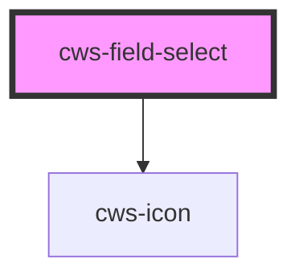

# cws-field-select

<!-- Auto Generated Below -->

## Properties

| Property         | Attribute          | Description                                | Type      | Default     |
| ---------------- | ------------------ | ------------------------------------------ | --------- | ----------- |
| `clearIfInvalid` | `clear-if-invalid` | Clear field value if no item match with it | `boolean` | `true`      |
| `disabled`       | `disabled`         | Input disabled prop                        | `boolean` | `false`     |
| `error`          | `error`            | Input error prop                           | `boolean` | `false`     |
| `hint`           | `hint`             | Input helper message                       | `string`  | `undefined` |
| `items`          | --                 | Expected an array to populate select       | `Item[]`  | `undefined` |
| `label`          | `label`            | Input label prop                           | `string`  | `'Label'`   |
| `name`           | `name`             | Input name prop                            | `string`  | `'name'`    |
| `required`       | `required`         | Select required prop                       | `boolean` | `false`     |
| `value`          | `value`            | Input value                                | `string`  | `''`        |

## Dependencies

### Depends on

- [cws-icon](../cws-icon)

### Graph

----------------------------------------------

*Built with [StencilJS](https://stenciljs.com/)*
