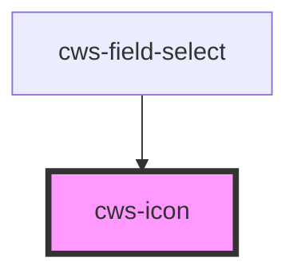

# cws-icon

<!-- Auto Generated Below -->

## Properties

| Property | Attribute | Description | Type                                            | Default     |
| -------- | --------- | ----------- | ----------------------------------------------- | ----------- |
| `icon`   | `icon`    | Icon slug   | `string`                                        | `undefined` |
| `size`   | `size`    | Icon size   | `"lg" \| "md" \| "sm" \| "xl" \| "xs" \| "xxs"` | `'sm'`      |

## Dependencies

### Used by

 - [cws-field-select](../cws-field-select)

### Graph

----------------------------------------------

*Built with [StencilJS](https://stenciljs.com/)*
